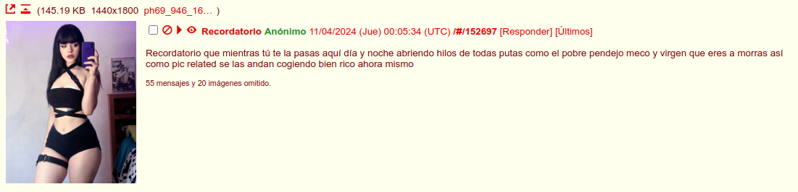
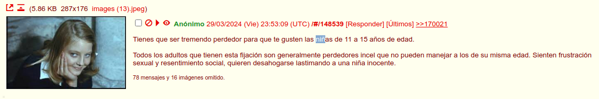
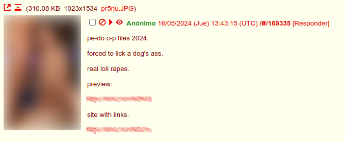
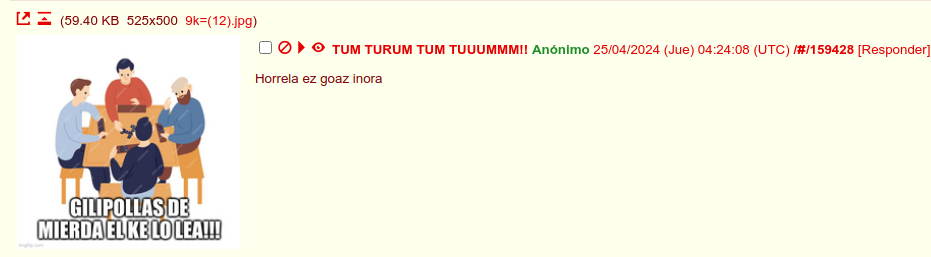
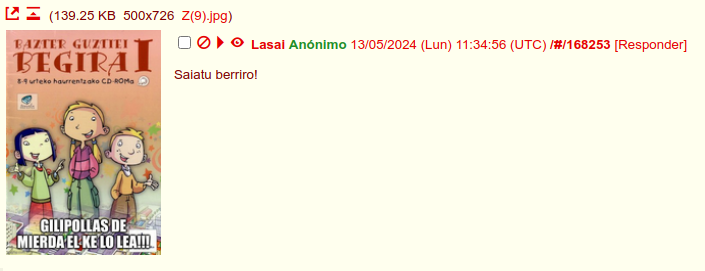

Inspirado por el manual para janitor de Hispachan publicado originalmente [en este hilo de Krautchan](https://krautchan.rip/hs/175801) (hoy en día considerado lost media) se me ocurrió hacer la siguiente guía de avarfags de Hispachan para que sea mas fácil detectarlos y así borrar su mierda (si eres mod/volunteer), reportarlos (si estos incumplen las reglas) o en ultima instancia ~~tirarles mierda~~ señalarlos con el dedo.

# Licencia
El siguiente trabajo esta publicado bajo la [WTFPL](https://es.wikipedia.org/wiki/WTFPL) salvo aclaración en contrario.

# ¿Que es un avatarfag?
Criterios que se tienen en cuenta a la hora de considerar a alguien un avatarfag:

* Que su estilo (ya de escritura y/o del tipo de imágenes que publica) sea tan evidente que se pueda deducir fácilmente quien es el avatarputo.
* Que haga flood o que su avatarfagueo sea muy evidente.
* Que no sea un avatarputo por razones del hilo X o Y. O sea, no esperen que aquí aparezcan los negros que hacen los hilos no fap, los juegos del hambre o viernes jorge (entre otros).

Agradecimientos al negro que posteo [la definición original](http://web.archive.org/web/20240519121023/https://archive.8chan.moe/hisparefugio/res/170050.html#170283).

# Aclaraciones
A continuación se enumeran algunos puntos que considero importantes para dejar las cosas mas claras:

1. El que elaboro este documento no es dueño o moderador de ningún tablón/chan ni tiene relación alguna con el staff de estos, solo es un negro que quiso llevar a cabo una idea ~~autista~~ que se le ocurrió.
2. Esto no es para listar a tus enemigos personales o a los negros que hacen hilos sobre las temáticas que no te gustan. ¿Eso te arde?, entonces eres libre de hacer un fork de este repositorio y editarlo como te salga de los huevos.
3. Si bien esto se publica bajo la WTFPL (*"licencia pública haz lo que carajo quieras"*), el dueño del repositorio se reserva el derecho de agregar lo que considere conveniente. ¿Eso también te molesta?, entonces remitirse al punto anterior.

# Como contribuir
Puedes abrir un issue, enviar un pull request o un email a mierdailustrada (arroba) tutanota.com
También puedes dejar tu aporte en el hilo meta del refugio (suelo visitar el tablón prácticamente a diario).

# Avatarfags conocidos
Avatarputos que operan normalmente en el refugio (y quizás en otros chanes) y como reconocerlos.

---

* Alias: Desmotivador
* Descripción: Se dedica a hacer hilos del tipo *"mientras tu estas haciendo X* (generalmente cosas que tienen que ver con el chan) *te pierdes de hacer Y"* (por lo general cosas de normies) intentando que los negros se sientan mal por estar chaneando.

---

* Alias: Pedrobot
* Descripción: Crea hilos con palabras claves modificadas para saltarse los filtros antispam y enlaces fraudulentos que ofrecen "**C**alidad **P**remium" (normalmente estafas y/o honeypots que registran la ip del usuario). Al ver uno de estos hilos se recomienda hacer tanto un reporte global así como uno local (a veces los moderadores globales se demoran en hacer su trabajo). Se dice que opera en varios chanes.

---

* Alias: Horrelas
* Descripción: Se caracteriza por publicar una imagen con el texto "GILIPOLLAS DE MIERDA EL KE LO LEA!!!" junto con alguna frase en catalan, vasco o algun dialecto moroñol. Viene haciendo lo mismo desde que Hispachan existia y se presume que tambien ha estado en otros foros y chanes.!
